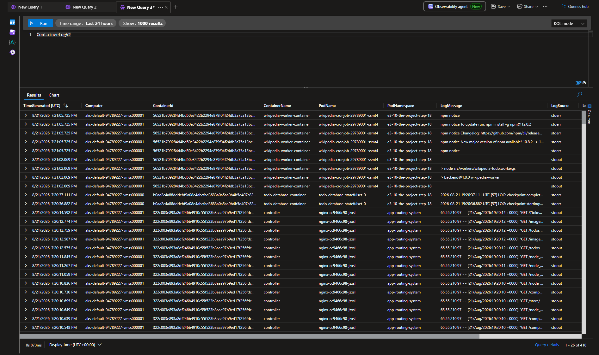

# 3.12 The Project, Step 20

GKE includes monitoring systems already so we can just enable the monitoring.

Read the documentation for Kubernetes Engine Monitoring here(opens in a new tab). Find out how to find the application logs for the project in GKE.

Add to your repository a picture of the logs when a new todo is created.

### How to run:

NOTE: This exercise uses Azure resources and Terraform. Make sure you have an active Azure account, an available subscription, and permission to create resources. To install Terraform, follow the official [HashiCorp installation guide.](https://developer.hashicorp.com/terraform/install?utm_source=chatgpt.com)

To run this application, execute the following commands in your command-line.

```bash
# Run the script.
./script.sh
```

### How to test:

To test this application, execute the following commands in your command-line.

```bash
# Get the ingress ADDRESS in the e3-8-the-project-step-17 namespace.
kubectl get ingress -n e3-10-the-project-step-18

# You should see a similar response:
NAME                 CLASS                                HOSTS   ADDRESS        PORTS   AGE
todo-ingress   webapprouting.kubernetes.azure.com  *       10.234.56.78   80      1m
```

```bash
# Open the log-output-ingress ADDRESS address in your browser. 
http://10.234.56.78/
http://10.234.56.78/todos
```

### How to check the logs:

```bash
# Visit the Azure Portal to see the logs.
# 1. Go to portal.azure.com.
# 2. Open your AKS cluster.
# 3. Go to Monitoring > Logs.
# 4. Run a query to view the application logs.
```



```bash
# NOTE: Remember to destroy the resources afterward.
cd terraform
terraform destroy --auto-approve
```